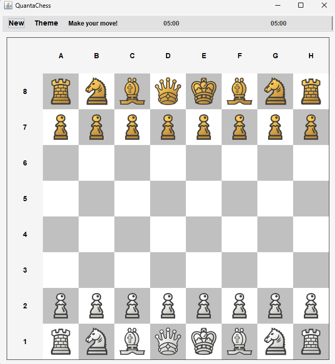
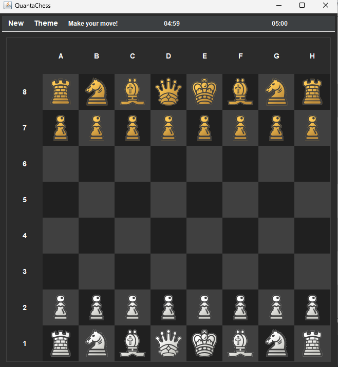

# > QuantaChess ♟️

QuantaChess is a simple chess game implemented in Java with a graphical user interface (GUI).

## How to Play:

1. **Starting a New Game:**
   - Click on the "New" button to start a new game. This resets the board to the initial state and starts the timers.

2. **Moving Pieces:**
   - To move a piece, click on the piece you want to move, then click on the destination square.
   - Valid moves will be highlighted. Clicking on a highlighted square will move the selected piece to that square.

3. **Promotion:**
   - If a pawn reaches the opponent's back rank, it will be automatically promoted to a queen.

4. **Check and Checkmate:**
   - The game detects when a player's king is in check and checkmate. The game ends when a player is checkmated.

5. **Time Control:**
   - Each player has 5 minutes to complete their moves. If a player's time runs out, the opponent wins.

6. **Toggle Theme:**
   - Click on the "Theme" button to switch between light and dark themes.
  
## Preview

  
  

## Notes

- **Finish** - Before clicking the confirm button on the quantachess start screen, complete the match and then enter all related information in the text fields.

## Controls

- **New:** Start a new game.
- **Theme:** Toggle between light and dark themes.

## Development

- The game is implemented in Java with Swing for the GUI.
- The GUI design follows a modern theme with light and dark mode options.

## Contributors

- [techmengg](https://github.com/techmengg) - Developer
- [BieKub](https://github.com/BieKub) - Developer
- [Scindere](https://github.com/Scindere) - Developer
- [ir.o2234](https://github.com/IreOluwa2236) - Developer
